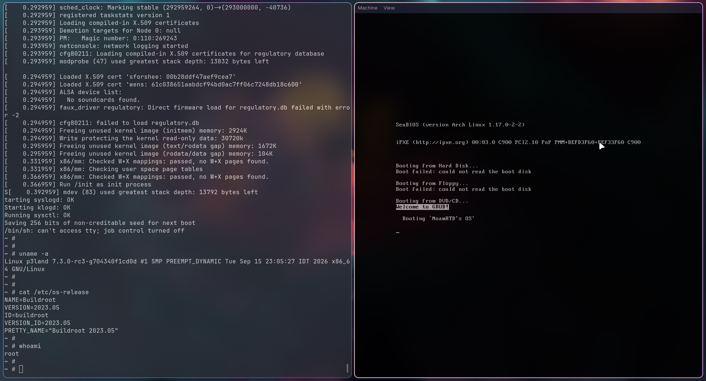

# AWS's EC2 (WIP)

Where I got up until now: A type 1 hypervisor for Intel VT-x, written from scratch in Zig, that boots Linux!

Features implemented as of 2026-09-29:
- Bare-metal x86-64 kernel:
    - GRUB as bootloader
    - Higher-half kernel with 4-level paging
    - HHDM (direct mapping of all physical memory)
    - GDT, TSS, IDT, interrupts + IRQ handling (8259 PIC, PIT)
    - Memory allocators: free-list heap, bitmap page allocator, 1GB guest-RAM allocator
- Intel VT-x virtualization:
    - VMXON / VMCS setup / VMLAUNCH and a VM-exit handling loop
    - EPT (Extended Page Tables)
    - Reading and writing guest memory, including walking the guest's page tables
    - CPUID virtualization
    - MSR virtualization
    - Control register emulation (CR0, CR3, CR4)
    - I/O port virtualization:
        - Virtual 8259 PIC
        - Virtual serial port (COM1)
    - Hardware IRQ injection into guest
    - `hlt` emulation (sleep until a guest interrupts arrive)
- Linux guest:
    - Linux x86 boot protocol (32-bit entry)
    - initramfs loading
    - Boots an unmodified Linux kernel all the way to a userspace shell

## Demo
#### Linux booting inside the hypervisor, running under QEMU:


On the left is the guest's serial console: the Linux kernel boots and drops into a root shell on a Buildroot initramfs.

## Building

**THIS PROJECT CURRENTLY WILL ONLY WORK ON INTEL-BASED CPUS AND WAS TESTED ONLY UNDER A LINUX HOST IN QEMU**

You will need Zig `0.16.0`, `nasm`, and `grub-mkrescue` (from GRUB, which also needs `xorriso` and `mtools`).

The guest kernel (`src/os/linux/linuxBzImage`) and its initramfs
(`src/os/linux/rootfs.cpio.gz`) are already included in the repo.

Build the hypervisor and the bootable ISO with
```sh
zig build
```

## Running

**THIS PROJECT CURRENTLY WILL ONLY WORK ON INTEL-BASED CPUS AND WAS TESTED ONLY UNDER A LINUX HOST IN QEMU**

The build output is `zig-out/kernel.iso`, which holds GRUB, the hypervisor,
and the Linux guest.
The hypervisor needs an Intel CPU with VT-x and EPT. The easiest way to run it
is QEMU with KVM and nested virtualization enabled on the host.

### Host requirements (Linux host)
- **KVM access**: your user must be able to open `/dev/kvm` (on some distros
  this means joining the `kvm` group). See your distro's KVM documentation.
- **Nested virtualization**: so the hypervisor can use VT-x inside the QEMU VM.
  Check it with `cat /sys/module/kvm_intel/parameters/nested` (should print `Y`),
  and see [Running nested guests with KVM](https://docs.kernel.org/virt/kvm/x86/running-nested-guests.html)
  to enable it.

### Launching
```sh
qemu-system-x86_64 -cdrom zig-out/kernel.iso -serial stdio -enable-kvm -cpu host,vmx=on -m 8G
```
The guest's console goes to the serial port, so it shows up in your terminal.

To build and run with QEMU in one step, use
```sh
zig build run
```
QEMU gets 8GB of RAM by default. Change it with `-Dmem`, for example `zig build run -Dmem=16G`.

To start QEMU paused, waiting for a GDB connection on `:1234`, use
```sh
zig build debug
```
